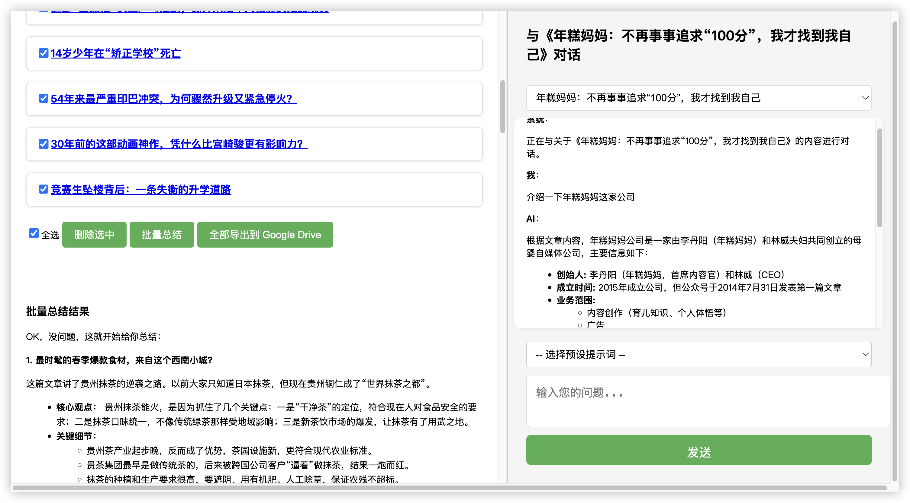

          
# 公众号文章抓取与总结助手

一个帮助你抓取和总结微信公众号文章的 Chrome 扩展。

## 主要功能

- 自动抓取公众号文章内容
- 使用 Gemini AI 生成文章总结
- 支持批量总结多篇文章
- 提供预设提示词快速对话
- 支持导出文章到 Google Drive

## 安装说明

1. 下载扩展文件
2. 打开 Chrome 浏览器，进入扩展管理页面（chrome://extensions/）
3. 开启开发者模式
4. 点击「加载已解压的扩展程序」，选择扩展文件夹

## 使用方法

1. 首次使用配置
   - 点击扩展图标，进入选项页面
   - 配置 Gemini API Key
   - 设置总结提示词（可选）
   - 配置预设提示词（可选）

2. 抓取文章
   - 在微信中打开公众号文章
   - 点击右上角菜单，选择「在浏览器中打开」
   - 确保使用安装了该插件的 Chrome 浏览器打开文章
   - 点击扩展图标
   - 文章标题就会自动显示在选项页面

3. 总结文章
   - 在选项页面选择要处理的文章
   - 点击「批量总结」开始生成摘要
   - 等待总结完成

4. 高级功能
   - 使用预设提示词与文章进行对话
   - 导出文章到 Google Drive
   - 自定义总结提示词

## 当前限制

1. AI 模型限制
   - 目前仅支持 Gemini 大模型
   - 需要自行提供 Gemini API Key

2. 总结格式不稳定
   - 默认使用 Markdown 格式输出
   - 偶尔会出现 JSON 格式的回复
   - 遇到格式异常时可以重试

## 使用建议

- 如果总结结果不理想：
  - 调整提示词内容
  - 重新尝试总结
  - 使用预设提示词进行对话
  - 多尝试几次，选择最佳结果

- 批量处理时：
  - 建议一次处理文章不宜过多（20 篇以内，以免输出被截断）
  - 确保网络连接稳定
  - 耐心等待所有文章处理完成

## 问题反馈

如果在使用过程中遇到问题或有改进建议，欢迎提出反馈。
        