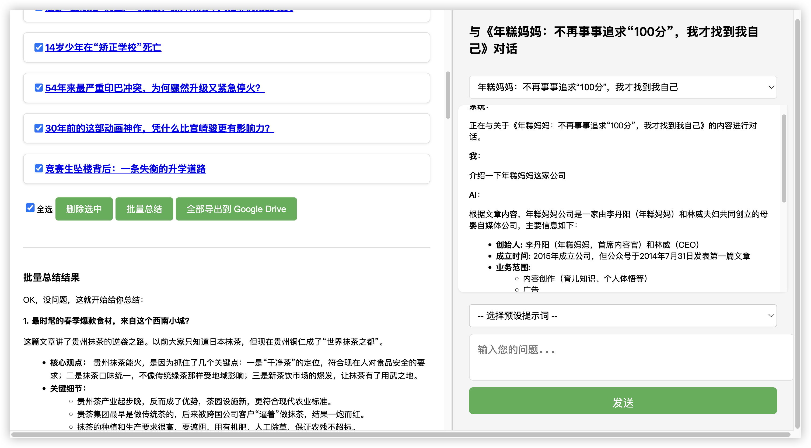

# 公众号文章抓取与对话助手

一个面向微信公众号文章的 Chrome 扩展，用来抓取文章、集中管理、批量总结，并把选中文章一键送到 AI Chat 页面继续处理。



## 当前能力

- 自动抓取微信公众号文章内容并保存到本地
- 支持排除指定公众号 URL，避免误抓取后台编辑页或特定页面
- 支持手动抓取当前页面，也支持给指定站点注入“抓取当前页面”按钮
- 支持批量总结多篇文章
- 支持基于单篇文章与 Gemini 进行流式对话
- 支持预设提示词，便于快速发起常见提问
- 支持将选中文章导出为 `JSON`、`TXT`、`Markdown`
- 支持将选中文章复制到剪贴板
- 支持把选中文章发送到指定 AI Chat URL
- 支持在 AI Chat 页面自动填入内容，并尝试自动提交
- 支持本地导入文章数据

## 适用场景

- 批量保存公众号文章做后续整理
- 用 Gemini 快速总结一组文章
- 对单篇文章做追问、摘取金句、抽取数据
- 把选中的文章直接发送到 ChatGPT / 自定义 GPT / 其他聊天式 AI 页面继续处理

## 安装方式

1. 下载或克隆本仓库
2. 打开 Chrome 浏览器，进入 `chrome://extensions/`
3. 开启右上角“开发者模式”
4. 点击“加载已解压的扩展程序”
5. 选择当前项目目录

每次本地修改扩展代码后，需要在扩展管理页点击一次“重新加载”。

## 快速开始

### 1. 初始配置

点击扩展图标后进入管理页面，建议先配置这些内容：

- `Gemini API Key`
- `AI Chat URL`
- 总结提示词
- 自动抓取排除列表
- 本地导出格式
- 预设提示词

### 2. 抓取公众号文章

常见流程：

1. 在微信里打开公众号文章
2. 选择“在浏览器中打开”
3. 用已安装本扩展的 Chrome 打开文章
4. 扩展会自动抓取文章并保存到本地列表

也可以通过以下方式手动抓取：

- 点击 popup 中的“抓取当前页面”
- 使用快捷键 `Ctrl+Shift+F`（macOS 为 `Control+Shift+F`）
- 给自定义站点注入“抓取当前页面”按钮后手动触发

### 3. 排除不想自动抓取的页面

在设置中的“自动抓取排除列表”里，一行填写一个规则。

支持：

- 完整 URL 匹配
- URL 前缀匹配
- URL 片段模糊匹配

适合用来排除这类页面：

- 公众号后台编辑页面
- 某些不希望自动入库的特殊文章页
- 带特定参数的页面

示例：

```text
https://mp.weixin.qq.com/cgi-bin/appmsg?t=media/appmsg_edit_v2&action=edit
biz=MzA3NTYzODYzNQ==
```

### 4. 管理和处理文章

文章进入列表后，可以进行这些操作：

- 全选
- 选择最近 N 篇
- 删除选中文章
- 导出选中文章到本地
- 导入本地文章文件
- 复制选中文章到剪贴板

## AI 功能

### 批量总结

选中文章后点击“总结”，扩展会把文章内容整理后发给 Gemini，返回 Markdown 结果并展示在页面中。

适合：

- 批量扫读文章
- 做精选摘要
- 快速形成阅读笔记

### 单篇文章对话

每篇文章都可以发起单独对话。

对话能力包括：

- 围绕文章继续追问
- 流式返回 Gemini 回复
- 保留最近几轮上下文
- 支持复制 AI 回复的 Markdown 或纯文本

### 预设提示词

管理页内置了一组预设提示词，也支持自行编辑。适合快速触发常见任务，比如：

- 大白话科普
- 展开解释
- 故事案例提炼
- 数据抽取
- 金句提取
- Aha Moment 提炼
- 全文总结

## 发送到 AI Chat

这是最近新增的一条工作流。

在设置中填入 `AI Chat URL` 后，选中文章点击“发送到 AI Chat”，扩展会：

1. 将选中文章整理成 JSON 文本
2. 自动复制到剪贴板
3. 打开指定的 AI Chat 页面
4. 尝试将内容自动填入输入框
5. 尝试自动提交

适合这种 URL：

- ChatGPT 对话页
- 自定义 GPT 页面
- 其他有聊天输入框的 AI 页面

说明：

- “打开页面 + 复制剪贴板”是稳定支持的
- “自动填入并提交”依赖目标站点的页面结构和交互限制
- 如果目标页面拦截脚本输入，至少仍然可以手动粘贴

## 本地导入导出

支持三种本地导出格式：

- `JSON`
- `TXT`
- `Markdown`

导入时当前支持 `JSON` 文件，适合做：

- 文章归档
- 多设备迁移
- 与其他 AI / 笔记工具联动

## 数据存储

文章和设置都保存在浏览器本地存储中，主要包括：

- 文章列表
- Gemini API Key
- 总结提示词
- AI Chat URL
- 自动抓取排除列表
- 本地导出格式
- 预设提示词

## 项目结构

```text
.
├── background.js        # 后台逻辑，负责抓取调度与保存
├── content.js           # 页面注入逻辑，负责自动抓取、AI Chat 自动填充
├── utils.js             # 公众号文章解析辅助函数
├── Readability.js       # 正文提取
├── popup/               # 扩展弹窗
├── options/             # 管理页面
├── manifest.json        # Chrome Extension Manifest V3
└── snapshot.png         # 截图
```

## 当前限制

### AI 总结与对话

- 目前主要围绕 Gemini API 实现
- 需要自行提供有效 API Key
- 大批量文章总结时，模型返回长度和稳定性仍受限制

### AI Chat 自动接力

- 并非所有 AI 网站都保证能自动填入和自动提交
- 页面结构变化后，可能需要针对目标站点重新适配选择器
- “等待 GPT 完整处理结束”目前没有做成通用能力

### 数据与同步

- 文章保存在本地浏览器中，不是云同步方案
- 更换浏览器环境时需要自行导出再导入

## 使用建议

- 批量总结时建议分批处理，避免单次内容过长
- 排除列表建议优先写更稳定的 URL 前缀或关键参数
- 若发现扩展行为和代码不一致，优先确认是否已在 `chrome://extensions/` 点击重新加载
- 如果 AI Chat 页面没自动填入，可直接手动粘贴，剪贴板内容已经准备好

## 后续可继续扩展的方向

- 针对特定 AI 页面做更稳定的自动提交与状态检测
- 支持更多导入导出格式
- 支持文章搜索与分类
- 支持更细粒度的抓取规则

## 问题反馈

如果你在使用中遇到问题，或者想继续增强某条工作流，可以直接基于当前代码继续迭代。
